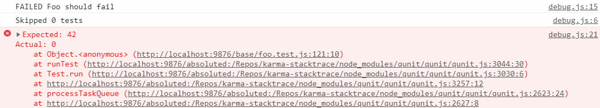

# karma-stacktrace

## What
This is a karma framework for providing human-readable sourcemapped stacktraces in a browser.

## Why
Popular test frameworks ([Jasmine](http://jasmine.github.io/), [QUnit](https://qunitjs.com/)) uses [non-standard](https://developer.mozilla.org/en-US/docs/Web/JavaScript/Reference/Global_Objects/Error/Stack) `stack` property of `Error` objects to output a trace when unit tests fail for some reasons. Stacktraces are intended to assist in understanding causes of failed tests, but they become useless without applied sourcemaps. Modern browsers support sourcemaps when viewing stacktraces from **errors** in their native console, but there is no support for applying sourcemaps to the `Error.prototype.stack`.

Exampled of an unmapped stacktrace for a failed test:



The framework is designed to catch failed tests and provide sourcemapped stacktraces by using [stacktrace-js](https://www.stacktracejs.com/) library. It also clears stacktraces from usually useless traces of a testing framework. At the same time it does not affect original stacktraces.


## How
### Install
`npm install karma-stacktrace`

### Karma configuraton
Add `karma-stacktrace` to a list of frameworks in corresponding karma configuration:

```js
//karma.conf.js
module.exports = function(config) {
  config.set({
    //...
    frameworks: ['karma-stacktrace'],
    //...
  });
};
```

## Limitations
- At the moment the framework supports only [Jasmine](http://jasmine.github.io/) and [QUnit](https://qunitjs.com/) testing frameworks.
- The framework attaches isolated reporters to provide sourcemapped stacktraces, so it doesnt affect original stacktraces.

## Inspired by
- [sourcemapped-stacktrace](https://github.com/novocaine/sourcemapped-stacktrace)

