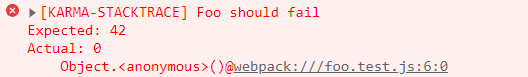

# karma-stacktrace
[]()
[](https://raw.githubusercontent.com/sergei-startsev/karma-stacktrace/master/LICENSE)

## What
Provides readable mapped stacktrace for failed tests to debug the them in your browser.

## Motivation
Test frameworks like [QUnit](https://qunitjs.com/) and [Jasmine](http://jasmine.github.io/) use [non-standard](https://developer.mozilla.org/en-US/docs/Web/JavaScript/Reference/Global_Objects/Error/Stack) `stack` property of `Error` object to output a stacktrace for failed unit tests. Modern browsers do not apply sourcemaps to `Error.prototype.stack` and unmapped stacktrace looks useless.

An example of an unmapped stacktrace:


The framework catches failed tests and reports mapped stacktrace by using [stacktrace-js](https://www.stacktracejs.com/) library:




## Install
Install with `yarn`:

`yarn add  karma-stacktrace`

With `npm`:

`npm install karma-stacktrace` 

## Karma configuration
Add `stacktrace` to the list of frameworks for a corresponding karma configuration:

```js
// karma.conf.js
module.exports = function(config) {
  config.set({
    //...
    frameworks: ['stacktrace'],
    //...
  });
};
```

To avoid blocking the main execution thread of a web application [Web Workers](https://developer.mozilla.org/en-US/docs/Web/API/Web_Workers_API) are used by default for parsing/mapping stacktrace, however you can disable it (you might need it for inline sourcemaps):

```js
// karma.conf.js
module.exports = function(config) {
  config.set({
    //...
    client: {
      stacktrace: {
        useWorker: false
      }
    },
    //...
  });
};
```

## Limitations/Gotchas
- At the moment the framework supports only [Jasmine](http://jasmine.github.io/) and [QUnit](https://qunitjs.com/) testing frameworks.
- The framework attaches isolated reporters to trace mapped stacktrace, it **does not affect** stacktrace in original messages.
- It is recommended to set `useWorker` option to `false` value for inline sourcemaps to get mapped stacktrace.

## Examples
See [examples](https://github.com/sergei-startsev/karma-stacktrace/tree/master/examples) folder for details.

## Inspired by
- [sourcemapped-stacktrace](https://github.com/novocaine/sourcemapped-stacktrace)

